**ΠΑΝΕΠΙΣΤΗΜΙΟ ΠΕΙΡΑΙΩΣ**

**ΣΧΟΛΗ ΤΕΧΝΟΛΟΓΙΩΝ ΠΛΗΡΟΦΟΡΙΚΗΣ ΚΑΙ ΤΗΛΕΠΙΚΟΙΝΩΝΙΩΝ ΤΜΗΜΑ ΨΗΦΙΑΚΩΝ ΣΥΣΤΗΜΑΤΩΝ**

ΕΥΡΕΤΗΡΙΑΣΗ ΧΩΡΟ-ΚΕΙΜΕΝΙΚΩΝ ΔΕΔΟΜΕΝΩΝ

**ΓΕΩΡΓΙΟΣ ΚΑΡΑΓΚΟΥΝΗΣ-Ε17064**

**Υπό την επίβλεψη του καθηγητή Χρηστού Δουλκερίδη**

**ΠΕΙΡΑΙΑΣ**

**ΜΗΝΑΣ ΕΤΟΣ**

**ΠΕΡΙΛΗΨΗ**

Στην συγκεκριμένη πτυχιακή μελετάται το πρόβλημα της επεξεργασίας ενός μεγάλου αριθμού στατικών ερωτημάτων χωρικών λέξεων-κλειδιών, τα οποία είναι απαραίτητα σε πολλές εφαρμογές, όπως η σύσταση βάσει τοποθεσίας. Για παράδειγμα, ένα σύστημα οπού παρέχει υπηρεσίες που σχετίζονται με το λιανικό εμπόριο. Πιο συγκεκριμένα έχει αποθηκευμένα σε μια βάση δεδομένων όλα τα αντικείμενα που είναι προς πώληση μαζί με τις συντεταγμένες του καταστήματος που τα έχει στην κατοχή του και δίνει την δυνατότητα στον χρήστη να μπορεί να αναζητήσει ένα αντικείμενο που είναι προς πωλήσει σε μια συγκεκριμένη γεωγραφική κλίμακα. Έστω ότι ένας χρήστης θέλει να βρει μια συγκεκριμένη επωνυμία παπουτσιού ( π.χ. shoes Nike το οποίο αποτελεί το κειμενικό μέρος του ερωτήματος) σε μια γεωγραφική κλίμακα ( π.χ. στα 1000 μετρά από το σπίτι του το οποίο αποτελεί το γεωγραφικό μέρος του ερωτήματος) τότε το σύστημα σε αυτήν την περίπτωση θα του επιστέψει όλα τα καταστήματα οπού έχουν στην κατοχή τους την συγκεκριμένη επωνυμία παπουτσιού και είναι μέσα στην συγκεκριμένη τοποθεσία. Υπάρχουν αρκετές προηγούμενες προσεγγίσεις που στοχεύουν στην παροχή αποτελεσματικών τεχνικών επεξεργασίας δεδομένων για το συγκεκριμένο πρόβλημα, οι προσεγγίσεις αυτές ανήκουν στη πρώτα κατά χώρο (spatial-first) μέθοδο ευρετηρίασης που δεν μπορεί να εκμεταλλευτεί καλά τη κατανομή λέξεων-κλειδιών. Επιπλέον, οι τεχνικές φιλτραρίσματος κειμένου που χρησιμοποιούν βασίζονται σε απλές παραλλαγές παραδοσιακών ανεστραμμένων ευρετηρίων (inverted indexes), τα οποία δεν έχουν καλή απόδοση για τον περιορισμό κειμένου που επιβάλλεται από το πρόβλημα.

Για να αντιμετωπιστούν οι παραπάνω περιορισμοί έχουν προταθεί στην πρόσφατη βιβλιογραφία δυο ευρετήρια το AP-Tree και το FAST. Πιο συγκεκριμένα το AP-Tree ομαδοποιεί τις καταχωρημένες ερωτήσεις χρησιμοποιώντας λέξεις-κλειδιά και χωρικά διαμερίσματα, καθοδηγούμενα από ένα μοντέλο κόστους ενώ το FAST ομαδοποιεί τις καταχωρημένες ερωτήσεις χρησιμοποιώντας τη διαφορά στις συχνότητες των λέξεων- κλειδιών εντός των αντίστοιχων κελίων (οπού κατανέμονται βάσει τοποθεσίας) σε μια δομή πλέγμα. Σε αυτή την πτυχιακή αναλύεται ο τρόπος δημιουργίας του κάθε ενός από αυτά αλλά και συγκρίνεται η απόδοση τους.

**ΘΕΜΑΤΙΚΗ ΠΕΡΙΟΧΗ**: Ευρετηρίαση

**ΛΕΞΕΙΣ ΚΛΕΙΔΙΑ**: Χωρo-κειμενικά δεδομένα, ευρετήριο, AP-Tree, FAST

**ABSTRACT**

In this degree thesis studied the problem of processing a large amount of static spatial- keyword queries over streaming data, which is essential in many applications such as location based recommendation. For example, a system that provides services related to retail. More specifically, system has stored in a database all the items that are for sale with the coordinates of the store and gives the opportunity to user to search for an item that is for sale in a specific geographical scale. Suppose that a user wants to find a specific shoe brand (eg Nike shoes which is the text part of the query) on a geographical scale (eg 1000 meters from his home which is the geographical part of the query) then the system in this case will return all the stores where they own the specific shoe brand and are in the specific location. There are several prior approaches aiming at providing efficient data processing techniques for the problem, their approaches belong to spatial-first indexing method which cannot well exploit the keyword distribution. In addition, their textual filtering techniques are built upon simple variants of traditional inverted indexes, which do not perform well for the textual constraint imposed by the problem.

In order to address the above limitations, two indexes, AP-Tree and FAST, have been proposed in the recent literature. Specifically, AP-Tree groups registered queries using keywords and spatial partitions, guided by a cost model, while FAST groups registered queries using difference in the frequencies of the keywords within their respective spatial regions. In this dissertation I will analyze how to create each of them and I will compare them with each other.

**SUBJECT AREA**: Indexing

**KEYWORDS**: Spatio-textual data, index, AP-Tree, FAST

Περιεχόμενα

[ΠΡΟΛΟΓΟΣ 6](#προλογος)

1.  [ΕΙΣΑΓΩΓΗ 7](#εισαγωγη)
    1.  [ΠΡΟΚΛΗΣΕΙΣ 8](#προκλησεις)
        1.  [AP-TREE 8](#ap-tree)
        2.  [FAST 8](#fast)
    2.  [ΣΥΝΤΟΜΗ ΠΕΡΙΓΡΑΦΗ ΕΝΟΤΗΤΩΝ 8](#συντομη-περιγραφη-ενοτητων)
2.  [AP-TREE 9](#ap-tree-1)
    1.  [ΕΙΣΑΓΩΓΗ 9](#εισαγωγη-1)
    2.  [ΚΕΙΜΕΝΙΚΟΣ ΚΟΜΒΟΣ 9](#κειμενικος-κομβος)
        1.  [ΠΑΡΑΔΕΙΓΜΑ 10](#_bookmark9)
    3.  [ΧΩΡΙΚΟΣ ΚΟΜΒΟΣ 10](#χωρικος-κομβος)
        1.  [ΠΑΡΑΔΕΙΓΜΑ 11](#_bookmark11)
    4.  [ΨΕΥΤΙΚΗ ΠΕΡΙΚΟΠΗ 11](#ψευτικη-περικοπη)
    5.  [ΨΕΥΤΙΚΟ ΚΕΛΙ 11](#ψευτικο-κελι)
    6.  [ΚΑΤΑΣΚΕΥΗ AP-TREE 12](#κατασκευη-ap-tree)
        1.  [ΜΟΝΤΕΛΟ ΚΟΣΤΟΥΣ 12](#μοντελο-κοστους)
        2.  [ΑΛΓΟΡΙΘΜΟΣ ΕΙΣΑΓΩΓΗΣ 13](#αλγοριθμος-εισαγωγης)
        3.  [ΑΛΓΟΡΙΘΜΟΣ ΑΝΑΖΗΤΗΣΗΣ 15](#αλγοριθμος-αναζητησης)
        4.  [ΑΛΓΟΡΙΘΜΟΣ ΔΙΑΓΡΑΦΗΣ 16](#αλγοριθμος-διαγραφης)
    7.  [ΠΑΡΑΔΕΙΓΜΑΤΑ ΕΚΤΕΛΕΣΗΣ 16](#παραδειγματα-εκτελεσης)
        1.  [ΠΑΡΑΔΕΙΓΜΑ 1 16](#παραδειγμα-1)
        2.  [ΠΑΡΑΔΕΙΓΜΑ 2 17](#παραδειγμα-2)
3.  [FAST 18](#fast-1)
    1.  [ΕΙΣΑΓΩΓΗ 18](#εισαγωγη-2)
    2.  [RIL 18](#ril)
        1.  [ΠΑΡΑΔΕΙΓΜΑ ΕΚΤΕΛΕΣΗΣ 18](#παραδειγμα-εκτελεσης)
    3.  [AKI 19](#aki)
        1.  [ΣΠΑΝΙΟΙ ΚΑΙ ΣΥΧΝΟΙ ΚΟΜΒΟΙ 20](#σπανιοι-και-συχνοι-κομβοι)
        2.  [ΑΛΓΟΡΙΘΜΟΣ ΕΙΣΑΓΩΓΗΣ 20](#αλγοριθμος-εισαγωγης-1)
        3.  [ΑΛΓΟΡΙΘΜΟΣ ΑΝΑΖΗΤΗΣΗΣ 21](#αλγοριθμος-αναζητησης-1)
        4.  [ΠΑΡΑΔΕΙΓΜΑ ΕΚΤΕΛΕΣΗΣ 1 21](#παραδειγμα-εκτελεσης-1)
        5.  [ΠΑΡΑΔΕΙΓΜΑ ΕΚΤΕΛΕΣΗΣ 2 22](#παραδειγμα-εκτελεσης-2)
    4.  [ΧΩΡΙΚΗ ΠΥΡΑΜΙΔΑ 25](#χωρικη-πυραμιδα)
        1.  [ΠΛΕΓΜΑ 25](#πλεγμα)
    5.  [ΚΑΤΑΣΚΕΥΗ FAST 26](#κατασκευη-fast)
        1.  [ΑΛΓΟΡΙΘΜΟΣ ΕΙΣΑΓΩΓΗΣ 26](#αλγοριθμος-εισαγωγης-2)
        2.  [ΑΛΓΟΡΙΘΜΟΣ ΑΝΑΖΗΤΗΣΗΣ 27](#αλγοριθμος-αναζητησης-2)
        3.  [ΜΗ ΥΛΟΠΟΙΗΜΕΝΟΙ ΑΛΓΟΡΙΘΜΟΙ 28](#μη-υλοποιημενοι-αλγοριθμοι)
4.  [ΠΕΙΡΑΜΑΤΙΚΗ ΜΕΛΕΤΗ 29](#πειραματικη-μελετη)
    1.  [ΡΥΘΜΙΣΕΙΣ ΠΕΙΡΑΜΑΤΟΣ 29](#ρυθμισεις-πειραματος)
        1.  [ΔΕΔΟΜΕΝΑ 29](#δεδομενα)
        2.  [ΑΛΓΟΡΙΘΜΟΙ 29](#αλγοριθμοι)
        3.  [ΠΑΡΑΜΕΤΡΟΙ 30](#παραμετροι)
        4.  [ΜΕΤΡΗΣΕΙΣ 30](#μετρησεις)
    2.  [ΑΞΙΟΛΟΓΗΣΗ ΑΠΟΔΟΣΗΣ 30](#αξιολογηση-αποδοσης)
        1.  [ΑΞΙΟΛΟΓΗΣΗ ΣΕ ΔΙΑΦΟΡΕΤΙΚΑ ΣΥΝΟΛΑ ΔΕΔΟΜΕΝΩΝ 30](#αξιολογηση-σε-διαφορετικα-συνολα-δεδομενων)
5.  [ΣΥΜΠΕΡΑΣΜΑ 33](#συμπερασμα)
6.  [ΒΙΛΙΟΓΡΑΦΙΑ 34](#βιλιογραφια)

# ΠΡΟΛΟΓΟΣ

Η παρούσα πτυχιακή εργασία με τίτλο «Ευρετηρίαση χωρο-κειμενικών δεδομένων» εκπονήθηκε στο Τμήμα Ψηφιακών Συστημάτων του Πανεπιστημίου Πειραιά. Η εκπόνηση της πτυχιακής εργασίας έγινε στα πλαίσια συνεργασίας με τον κύριο Χρηστό Δουλκερίδη αναπληρωτή καθηγητή του πανεπιστήμιου Πειραιά.

Αντικείμενο της εργασίας αποτελεί η ευρετηρίαση χωρο-κειμενικών δεδομένων. Συγκεκριμένα, εξετάζονται δυο ευρετήρια τα οποία ειδικεύονται στην ευρετηρίαση τέτοιων δεδομένων.

# ΕΙΣΑΓΩΓΗ

Στις μέρες μας, πολλές εφαρμογές βασίζονται στην επεξεργασία και ανάλυση χωρικό- κειμενικών δεδομένων. Παραδείγματα τέτοιων εφαρμογών περιλαμβάνουν κοινωνικά δίκτυα (π.χ. Facebook) και μικρο-ιστολόγια (π.χ. Twitter). Αυτές οι εφαρμογές επεξεργάζονται χωρικο-κειμενικά δεδομένα σε τεράστια κλίμακα και σε πραγματικό χρόνο. Για παράδειγμα,

500 εκατομμύρια tweet και 9 εκατομμύρια check-in Foursquare δημιουργούνται και υποβάλλονται σε επεξεργασία καθημερινά. Αυτές οι εφαρμογές απαιτούν αποδοτική ανάκτηση χωρικο-κειμενικών δεδομένων ώστε να γίνεται εφικτή η αλληλεπίδραση με τον χρήστη, άρα απαιτούν την αποτελεσματική ευρετηρίασή αυτόν των δεδομένων, το οποίο πραγματοποιείται με κατάλληλα ευρετήρια που συνδυάζουν χώρο και κείμενο με ενιαίο τρόπο. Στα πλαίσια της επίτευξης αποδοτικής ανάκτησης χωρικο-κειμενικών δεδομένων, η πτυχιακή εστιάζει στην υλοποίηση και σύγκριση δυο γνωστών ευρετηρίων που αποσκοπούν στην βελτιστοποίηση ευρετηρίασης των χωρο-κειμενικών δεδομένων.

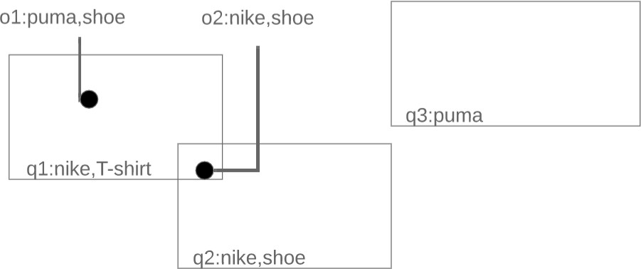

Εικόνα 1.1. Παράδειγμα συστήματος που παρέχει υπηρεσίες λιανικής.

Για να γίνει πιο κατανοητή λειτουργία ενός συστήματος οπού θέλει να ανακτήσει γρηγορά χωρο-κειμενικά δεδομένα είναι απαραίτητο να περιγράφει ένα παράδειγμα λειτουργίας. Όπως φαίνεται και στην από πάνω εικόνα (Εικόνα 1.1.) θα αναληθή ένα σύστημα διαμοιρασμού που παρέχει υπηρεσίες λιανικής. Στην παραπάνω λοιπών εικόνα φαίνονται 2 καταστήματα (o1,o2) τα οποία είναι αποθηκευμένα σε μια βάση δεδομένων αλλά και τρεις χρήστες οι οποίοι έχουν εκδηλώσει το ενδιαφέρων τους για κάποια προϊόντα γράφοντας ερωτήματα στο σύστημα (q1,q2,q3). Αυτά τα ερωτήματα έχουν συγκεκριμένο χώρο ισχύος αλλά και συγκεκριμένες λέξεις κλειδιά (π.χ. q1(nike,T-shirt)). Στο συγκεκριμένο παράδειγμα (Εικόνα 1.1.) το ερώτημα q3 δεν θα επιστέψει τίποτα καθώς κανένα object δεν ανήκει στην περιοχή ενδιαφέροντος του, το q1 επίσης δεν θα επιστρέψει κάτι καθώς υπάρχει αντικείμενο στην περιοχή ενδιαφέροντος του αλλά δεν περιέχει τις λέξεις που ζητούνται και το q2 γυρίζει το o2 καθώς πληρούνται όλες οι προϋποθέσεις δηλαδή ανήκει το o1 και στην περιοχή ενδιαφέροντος του ερωτήματος αλλά περιέχει και όλες τις λέξεις που ζητούνται.

## ΠΡΟΚΛΗΣΕΙΣ

Υπάρχουν δυο βασικές προκλήσεις στην αποτελεσματική επεξεργασία χωρικο-κειμενικών δεδομένων. Πρώτον, υπάρχει ένας τεράστιος αριθμός αντικειμένων που πρέπει να ευρετηριαστούν αποδοτικά με σκοπό να είναι γρήγορη η ανάκτηση τους. Δευτέρων, πρέπει να δημιουργηθούν νέες τεχνικές ανάπτυξης μηχανισμού ευρετηρίου χωρικο-κειμενικών αντικειμένων που προσαρμόζεται τόσο στις χωρικές όσο και στις κατανομές λέξεων- κλειδιών του ερωτήματος. Το κάθε ένα από τα δυο ευρετήρια προσπαθεί να φέρει εις πέρας αυτές της προκλήσεις με διαφορετικό τρόπο.

### AP-TREE

Με σκοπό να φέρει εις πέρας τις προκλήσεις που περιεγράφηκαν παραπάνω το AP-Tree

σχεδιάστηκε ως εξής :

-   Το AP-Tree αποτελεί ένα χωρο-κειμενικό δέντρο για την αντιμετώπιση του προβλήματος ευρετηρίασης αντικειμένων λέξεων-κλειδιών και χώρου. Αυτός είναι ο πρώτος χωρο- κειμενικός μηχανισμός ευρετηρίασης που δίνει προτεραιότητα στο χώρο και στο κείμενο.
-   Προτείνεται ένα μοντέλο κόστους για την αξιολόγηση της βέλτιστης κατάτμησης (partition) είτε ως προς κείμενο είτε ως προς τοποθεσία. Με την προσθήκη του μοντέλου κόστους το AP-Tree ευρετηριάζει τα δεδομένα με προσαρμοστικό τρόπο με αποτέλεσμα να ελαχιστοποιείτε το συνολικό κόστος.

### FAST

Με σκοπό να φέρει εις πέρας τις προκλήσεις που περιεγράφηκαν παραπάνω το FAST

σχεδιάστηκε ως εξής :

-   Το FAST, είναι ένα χωρο-κειμενικό ευρετήριο με γνώμονα τη συχνότητα. Το FAST είναι εξοπλισμένο με ένα νέο ευρετήριο προσαρμοστικής λέξης-κλειδιού (AKI) που προσαρμόζει τις συχνότητες των λέξεων-κλειδιών και δεν απαιτεί προηγούμενη γνώση του λεξιλογίου των λέξεων-κλειδιών.
-   Το FAST χρησιμοποιεί μια χωρική πυραμίδα (spatial-pyramid) με σκοπό την ευρετηριάσει των δεδομένων με γνώμονα την χωρική κατανομή.

## ΣΥΝΤΟΜΗ ΠΕΡΙΓΡΑΦΗ ΕΝΟΤΗΤΩΝ

Στην συνέχεια θα αναλυθούν σε βάθος τα δυο ευρετήρια (κεφάλαιο 2, κεφάλαιο 3). Στο κεφάλαιο 2 συγκεκριμένα θα παρουσιαστεί η αρχιτεκτονική του AP-tree δηλαδή το μοντέλο κόστους καθώς και τα διαφορά ειδή κόμβων που αποτελούν αυτήν την δομή με κάποια παραδείγματα εκτέλεσης. Στο κεφάλαιο 3 θα παρουσιαστεί η αρχιτεκτονική του AP-tree δηλαδή το ΑΚΙ index αλλά και ένα ανταγωνιστικό ευρετήριο το RIL ακόμα θα αναλυθεί και η χωρική πυραμίδα και τέλος θα παρουσιαστούν κάποια παραδείγματα εκτέλεσης. Στο κεφάλαιο 4 παρουσιάζονται τα αποτελέσματα της πειραματικής μελέτης οπού έχει πραγματοποιηθεί πάνω σε αυτούς τους δυο αλγορίθμους. Στο κεφάλαιο 5 αναγράφεται το συμπέρασμα που βγήκε μέσα από την ανάλυση που έγινε στην πειραματική μελέτη. Στο κεφάλαιο 6 καταγράφονται οι βιβλιογραφικές πήγες.

# AP-TREE

## ΕΙΣΑΓΩΓΗ

Σε αυτό το ευρετήριο, υπάρχουν τρεις τύποι κόμβων. Ο κόμβος λέξεων-κλειδιών (k-node), ο χωρικός κόμβος (s-node) και κόμβος ερωτημάτων (κόμβος q). Ένας ενδιάμεσος κόμβος είναι k-node (αντίστοιχα s-node) αν ο κόμβος υιοθετηθεί μοίρασμα με βάση τις λέξεις-κλειδιά (αντίστοιχα χωρικό διαμέρισμα). Ένα φύλλο κόμβος του AP-Tree αντιστοιχεί σε έναν κόμβο q και κάθε ερώτημα αντιστοιχιστεί σε έναν ή περισσότερους κόμβους ερωτήσεων. Στην εικόνα 2.1.1. φαίνεται ένα παράδειγμα εκτέλεσης όπου σύμφωνα με το οποίο περιγράφονται τα παραδείγματα στις επόμενες ενότητες αυτού του κεφαλαίου. Τα παραδείγματα σε αντίθεση με την υλοποίηση που έχει πραγματοποιηθεί για αυτήν την πτυχιακή αφορούν ροές δεδομένων δηλαδή ευρετηριάζουν τα queries αντί για τα objects καθώς η δομή έχει προταθεί για αυτό το σκοπό.

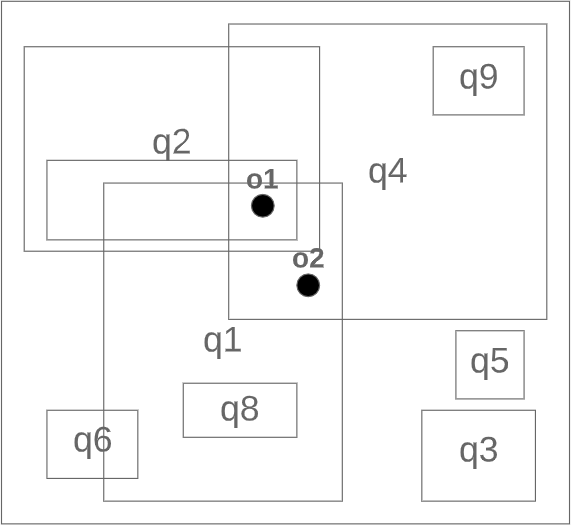

Εικόνα 2.1.1 Παράδειγμα εκτέλεσης

## ΚΕΙΜΕΝΙΚΟΣ ΚΟΜΒΟΣ

Υποθέτουμε ότι υπάρχει ένα λεξιλόγιο V και λέξεις-κλειδιά σε κάθε αντικείμενο όπου είναι διατεταγμένες με λεξικογραφική σειρά. Τα αντικείμενα που έχουν εκχωρηθεί σε έναν κόμβο Ν χωρίζονται σε f ταξινομημένες περικοπές (cuts) σύμφωνα με τις Nl-th λέξεις-κλειδιά τους, όπου Nl λέγεται η μετατόπιση κατατμήσεων του κόμβου N δηλαδή η μεταφορά του δείκτη σύμφωνα με τον οποίο θα επιλεγεί η λέξη κλειδί η οποία θα εισαχθεί στην διατεταγμένη κοπή οπού αναλύεται στην συνέχεια (π.χ. για δείκτη 2 από ένα αντικείμενο με λέξεις κλειδιά w1,w2 θα επιλεγεί το w2). Μια ταξινομημένη κοπή είναι ένα διάστημα λέξεων-κλειδιών, με την ένδειξη c [wi, wj] το οποίο περιέχει όλες τις λέξεις κλειδιά που επιλεχθήκαν σύμφωνα με τον δείκτη που αναλύθηκε προηγούμενος, όπου wi και wj (wi ≤ wj) είναι οι οριακές λέξεις- κλειδιά. Για να είναι πιο κατανοητό , χρησιμοποιώ c [wi] για να δηλώσω c [wi, wi] εάν υπάρχει μόνο μια λέξη-κλειδί στην περικοπή.

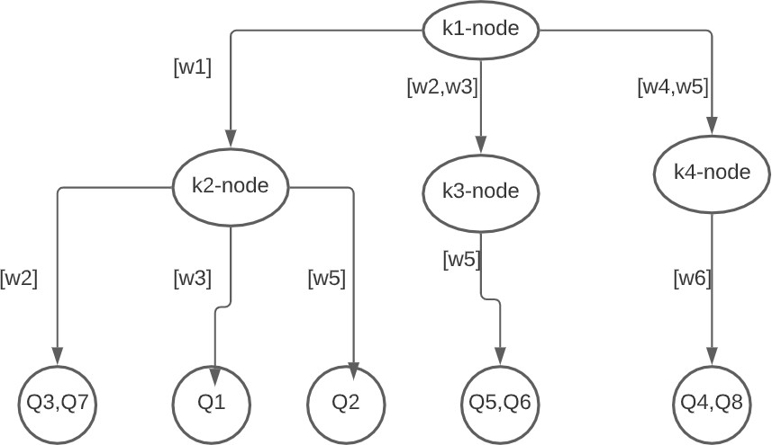

Εικόνα 2.2.1.1. Κατάτμηση με βάση τις λέξεις κλειδιά

Η Εικόνα 2.2.1.1. δείχνει μια ειδική περίπτωση AP-Tree (οπού μοιάζει αρκετά με την διαδεδομένη δομή δεδομένων trie) το οποίο χρησιμοποιεί μόνο κατάτμηση λέξεων-κλειδιών. Χρησιμοποιείται ένα οβάλ για την αναπαράσταση ενός κόμβου k. Εν τω μεταξύ, ένας κόμβος q δηλώνεται από έναν κύκλο. Ας υποθέσουμε ότι έχουν οριστεί 3 περικοπές σε κάθε κόμβο λέξεων-κλειδιών. Στον κόμβο k1 με μετατόπιση κατατμήσεων 1, συλλέγουμε τις πρώτες λέξεις-κλειδιά από 8 ερωτήματα που αντιστοιχούν {w1, w2, w3, w4, w5}. Αυτές οι λέξεις- κλειδιά μπορούν να χωριστούν σε 3 περικοπές: c [w1], c [w2, w3] και c [w4, w5]. Ερωτήματα

{q1, q2, q4, q5} αντιστοιχίζονται στο c [w1] του οποίου ο αντίστοιχος κόμβος είναι k2- κόμβος. Δεδομένου ότι η μετατόπιση κατατμήσεων του k2-node είναι 2, οι δεύτερες λέξεις- κλειδιά από αυτά τα ερωτήματα, δηλαδή, {w2, w3, w5}, χρησιμοποιούνται για την εκχώρηση ερωτημάτων σε τρεις τομές: c [w2], c [w3] και c [w5], καθένα από τα οποία είναι σχετίζεται με έναν κόμβο q.

## ΧΩΡΙΚΟΣ ΚΟΜΒΟΣ

Ο χώρος χωρίζεται από s-nodes. Το Nr δηλώνει την περιοχή ενός χωρικού κόμβου N, ο οποίος θα χωριστεί σε κελιά (cells) πλέγματος (grid) f. Ένα αντικείμενο σε έναν χωρικό κόμβο N ωθείται σε ένα κελί πλέγματος c εάν ο χώρος που καταλαμβάνει το συγκεκριμένο ερώτημα επικαλύπτει το c.

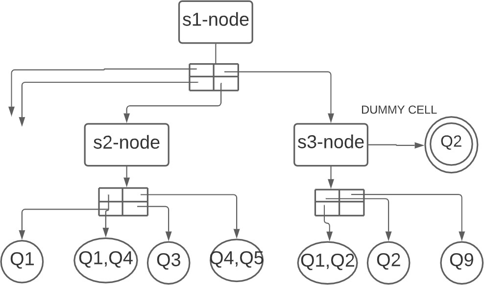

Εικόνα 2.3.1.1. Κατάτμηση με βάση την τοποθεσία

Στην εικόνα 2.3.1.1. απεικονίζεται μια άλλη ειδική περίπτωση του AP-Tree στο οποίο χρησιμοποιούνται μόνο χωρικές κατατμήσεις κατά την εκτέλεση. Εδώ, χρησιμοποιούμε ένα ορθογώνιο για την αναπαράσταση ενός κόμβου s. Σε κάθε s-node, η χωρική περιοχή χωρίζεται σε 4 κελιά. Για να τα ταιριάξουμε με ένα ερώτημα (με τον ίδιο τρόπο για αντικείμενο) , απλά χρησιμοποιούμε μια δομή πλέγμα με σκοπό να τα χωρίσουμε ανάλογα με την τοποθεσία τους. Παρατηρούμε ότι τα κελιά σε κάθε χωρικό κόμβο μπορεί να μην είναι ίσου μεγέθους.

## ΨΕΥΤΙΚΗ ΠΕΡΙΚΟΠΗ

Όταν οι λέξεις (keywords) ενός ερωτήματος δεν μπορούν να διασπαστούν παραπάνω καθώς το μήκος τους είναι μικρότερο από τον αριθμό που δηλώνει την μετατόπιση κατατμήσεων τότε το ευρετήριο φτιάχνει μια ψεύτικη περικοπή (dummy cut) κόμβο οπού μέσα σε αυτόν καταχωρεί το ερώτημα.

## ΨΕΥΤΙΚΟ ΚΕΛΙ

Όταν ο χώρος που καταλαμβάνει ένα ερώτημα είναι μεγαλύτερος από αυτόν του πλέγματος τότε το ευρετήριο φτιάχνει ένα ψεύτικό κελί (dummy cell) κόμβο οπού μέσα σε αυτόν καταχωρεί το αντικείμενο.

## ΚΑΤΑΣΚΕΥΗ AP-TREE

### ΜΟΝΤΕΛΟ ΚΟΣΤΟΥΣ

Λαμβάνοντας υπόψη ένα σύνολο αντικειμένων, το AP-Tree είναι κατασκευασμένο από πάνω προς τα κάτω. Επομένως, πρέπει να αξιολογηθεί τι είναι καλύτερο η κατάτμηση με βάση λέξεις-κλειδιά ή χωρική κατάτμηση έτσι ώστε το AP-Tree να είναι προσαρμοστικό. Σε αυτήν την υποενότητα, αναλύεται το μοντέλο κόστους το οποίο μετρά ποσοτικά το αντίστοιχο κόστος για δύο μεθόδους κατάτμησης.

#### ΚΑΤΑΤΜΗΣΗ ΜΕ ΒΑΣΗ ΛΕΞΕΙΣ-ΚΛΕΙΔΙΑ

Σε κάθε κόμβο στόχος είναι να βρεθεί η βέλτιστη κατάτμηση λέξεων-κλειδιών, έτσι ώστε το κόστος αντιστοίχισης να ελαχιστοποιείται. Το κόστος της κάθε κατάτμησης υπολογίζεται από τον παρακάτω τύπο οπού 𝑤(𝑤𝑗) είναι ο αριθμός των query οπού το l-th keyword είναι ίσο με το 𝑤𝑗 και 𝑝(𝑤𝑗) είναι η πιθανότητα το l-th keyword από ένα query να ισούται με το 𝑤𝑗 (l-th είναι ο αριθμός που δηλώνει την μετατόπιση των κατατμήσεων).

𝑚 𝑚

𝐶(𝑃(𝑖, 𝑚, 1)) = (∑ 𝑤(𝑤𝑗)) × (∑ 𝑝(𝑤𝑗))

𝑗=𝑖 𝑗=𝑖

Εικόνα 2.6.1.1.1. Τύπος υπολογισμού κόστους.

#### ΧΩΡΙΚΗ ΚΑΤΑΤΜΗΣΗ

Ο υπολογισμός του κόστους για μια χωρική κατάτμηση δίνεται από τον παρακάτω τύπο οπού

𝑤(𝐵𝑖,𝑗) είναι ο αριθμός των query που βρίσκονται μέσα στο 𝐵𝑖,𝑗 κελί του πλέγματος ενώ

𝑝(𝐵𝑖,𝑗) είναι η πιθανότητα ένα query να ανήκει στο 𝐵𝑖,𝑗 κελί του πλέγματος.

𝑚 𝑛

𝐶(𝑃𝑠) = ∑ ∑ 𝑤(𝐵𝑖,𝑗) × 𝑝(𝐵𝑖,𝑗) ≤ 1

𝑖=1 𝑗=1

Εικόνα 2.6.1.2.1. Τύπος υπολογισμού κόστους

### ΑΛΓΟΡΙΘΜΟΣ ΕΙΣΑΓΩΓΗΣ

Στον αλγόριθμο 1 παρουσιάζεται διαδικασία εισαγωγής-κατασκευής του AP-Tree, η οποία διαιρεί αναδρομικά τα αντικείμενα είτε μέσω λέξεων-κλειδιών είτε βάση τοποθεσίας. Δεδομένου ενός συνόλου Q αντικειμένων, ο τρέχων κόμβος N μπορεί να οριστεί σε q-node, k-node ή s node. Πιο συγκεκριμένα, χρησιμοποιούνται δύο σημαίες, kP και Sp εάν τα αντικείμενα στο Q μπορούν να χωριστούν περαιτέρω με λέξη-κλειδί ή τοποθεσία αντίστοιχα. Η γραμμή 2 διατηρεί όλα τα αντικείμενα σε έναν κόμβο q εάν ο αριθμός των αντικειμένων δεν υπερβαίνει ένα δεδομένο κατώτατο όριο θq ή τα αντικείμενα δεν μπορούν να χωριστούν περαιτέρω ανά λέξη-κλειδί ή τοποθεσία. Αν Επιτρέπεται η κατάτμηση λέξεων-κλειδιών (δηλαδή, το kP είναι αληθές), η Γραμμή 6 εξερευνά διαμέρισμα λέξεων-κλειδιών με offset l και το κόστος καταγράφεται από Ck. Υπενθυμίζεται ότι το offset l υποδηλώνει ότι οι λέξεις- κλειδιά l-th από τα αντικείμενα στο Q χρησιμοποιούνται για κατάτμηση λέξεων-κλειδιών. Από Cs καταγράφεται το κόστος της χωρικής κατάτμησης στη Γραμμή 8 εάν το sP είναι αληθές. Τότε μπορούμε να αποφασίσουμε για τον τρέχοντα κόμβο Ν αν θα κατασκευαστεί κατάτμηση λέξεων-κλειδιών (Γραμμή 10) ή χωρική κατάτμηση (Γραμμή 18) σε Ck και Cs. Τα αντικείμενα στο Q προωθούνται σε σχετικό κόμβο παιδί για περαιτέρω επεξεργασία (Γραμμή 16 και Γραμμή 24), στην οποία η μετατόπιση του διαμερίσματος αυξάνεται κατά ένα εάν επιλέγεται το διαμέρισμα λέξεων-κλειδιών. Εκτός από τις κανονικές περικοπές, διατηρούμε επίσης ψεύτικο cut (κελί) για k-node (s-node). Συγκεκριμένα, διατηρούμε ένα ψεύτικο κόψιμο για ένα k-node έτσι ώστε αντικείμενα των οποίων οι λέξεις-κλειδιά έχουν εξαντληθεί ωθούνται στο dummycut με kP ρυθμισμένο σε false (Γραμμές 11-13). Ομοίως, στις Γραμμές 19-21 ωθούνται όλα τα αντικείμενα με περιοχές που περιέχουν τον κόμβο N στο εικονικό κελί για περαιτέρω πιθανή κατάτμηση λέξεων-κλειδιών, όπου το sP έχει οριστεί σε false. Τέλος, το AP-Tree μπορεί να κατασκευαστεί από τη συνάρτηση Insertq (root, Q, 1, true, true).

Algorithm 1 Insertq(N,Q,I,kP,Sp)

Input : N : current node, Q : a set of queries

l : keyword partition offset to be used in N

kP & sP : flags for keyword and spatial partitions Output : AP-Tree

1.  if (kP is f alse and sP is f alse) or \|Q\| \< θq then
1.  N is a q-node for Q;
1.  return

4 Ck := +∞; Cs := +∞;

1.  if kP is true then
1.  Ck ← keyword partition on Q with offset l; 7 if sP is true then
2.  Cs ← spatial partition on Q;
1.  if keyword partition is chosen (i.e., Ck \< Cs) then
1.  N is a k-node with node offset Nl = l;
1.  Q’ ← queries {q} in Q with \|q.ψ\| \< l ;
1.  B’ ← dummy cut of N;
1.  Insertq( B’ ,Q’, l + 1, kP = false, sP) ;
1.  for each child node (i.e., cut) B of node N do
1.  QB ← queries in Q − Q which hit the cut B ;
1.  Insertq(B, QB, l + 1, kP, sP); 17 else
2.  N is a s-node;
1.  Q’ ← queries in Q which contains Nr;
1.  B’ ← dummy cell of N;
1.  BuildIndex(B21 , l, kP, sP = f alse) ;
1.  for each child node (i.e., cell) B of node N do
1.  QB ← queries in Q – Q which overlap or contain B ;
1.  Insertq(B,QB,l,kP,sP);

Αλγόριθμος 1. Κατασκευαστής AP-tree

### ΑΛΓΟΡΙΘΜΟΣ ΑΝΑΖΗΤΗΣΗΣ

Ο αλγόριθμος 2 απεικονίζει τη διαδικασία ανάκτησης όλων των αντικείμενα για ένα συγκεκριμένο ερώτημα o. Πρόκειται για μια αναδρομική διαδικασία οπού επαληθεύουμε εάν τα σχετικά αντικείμενα υπάρχουν σε έναν κόμβο Ν και τα καταχωρούμε στον R. Ουσιαστικά ελέγχουμε αν ο κόμβος ο οποίος διανύουμε την συγκεκριμένη στιγμή είναι q-node ή s-node ή k-node. Πιο συγκεκριμένα, αν είναι q-node ελέγχουμε αν τα αντικείμενα που είναι καταχωρημένα σε αυτόν πληρούν τα κριτήρια τοποθεσίας και κειμένου. Αν ναι τότε τα καταχωρούμε μέσα στον R. Σε περίπτωση που ο κόμβος είναι s-node τότε μετακινούμαστε μέσα στο grid στο αντίστοιχο κελί και καλούμε αναδρομικά την συνάρτηση για τον κόμβο που βρήκαμε εκεί. Στην αντίθετη περίπτωση οπού ο κόμβος είναι k-node τότε παίρνουμε από το εισερχόμενο ερώτημα το keyword που αντιστοιχεί στην θέση οπού δηλώνει το η και προπλάθουμε να βρούμε σε πoιo cut αντίστοιχη. Αν βρούμε το cut τότε επαναλαμβάνουμε την ιδιά διαδικασία για τον κόμβο που βρήκαμε εκεί μέσα αυξάνοντας το η κατά 1. Σε οποιαδήποτε από τις δυο τελευταίες περιπτώσεις ελέγχονται και οι dummy κόμβοι. Για να ανακτήσουμε όλα τα αντίστοιχα αντικείμενα καλούμε τη συνάρτηση Search (o, 1, root), όπου root είναι ο ριζικός κόμβος του AP-Tree.

Algorithm 2 Search (o,n,N)

Input : o : incoming object

η : the start matching position regarding o.ψ N : node accessed currently

Output : R : set of all the matched queries 1 if N is a q-node then

1.  Verify queries in N and insert the matched ones to R ;
1.  return
1.  if N is a k-node then
1.  for η ≤ i ≤ \|o.ψ\| do
1.  Find the corresponding cut based on wi in o.ψ;
1.  if cut has not been visited then
1.  Search(o, i + 1, cut) ;
1.  if dummy cut exists then
1.  Search(o, η, dummy cut); 11 else
2.  Find the cell which covers o.loc using grid structure;
1.  Search(o, η, cell);
1.  if dummy cell exists then
1.  Search(o, η, dummy cell);

Αλγόριθμος 2. Αλγόριθμος αναζήτησης για το AP-tree

### ΑΛΓΟΡΙΘΜΟΣ ΔΙΑΓΡΑΦΗΣ

Ουσιαστικά ο συγκεκριμένος αλγόριθμος είναι ίδιος με τον search απλά έχει δυο ουσιαστικές διάφορες ότι βρίσκει συγκεκριμένα αντικείμενα δηλαδή δίνονται ακριβείς συντεταγμένες αλλά και κείμενο και αντί να γυρίσει τα αποτελέσματα σε μια λίστα όπως γίνεται στον προηγούμενο αλγόριθμο τα διαγράφει.

## ΠΑΡΑΔΕΙΓΜΑΤΑ ΕΚΤΕΛΕΣΗΣ

Ο AP-Tree είναι ένας συνδυαστικός αλγόριθμος όπως είδαμε και στα προηγούμενα κεφάλαια. Συγκεκριμένα, συνδυάζοντας τα μοντέλα κόστους (κεφ. 2.6.1.) αλλά και τους κόμβους με τα παραδείγματα εισαγωγής όπου αναλυθήκαν στα προηγούμενα κεφάλαια (κεφ. 2.2.,2.3.,2.4.,2.5.) καταφέρνει να επιλεγεί πάντα την βέλτιστη λύση όσων αφορά την κατάτμηση. Το τελικό αποτέλεσμα γραφικά φαίνεται παρακάτω (εικόνα 2.7.2.). Εφόσον έχουν ήδη αναλυθεί με παραδείγματα οι τρόποι εισαγωγής θα κάνουμε το ίδιο και για τον τρόπο αναζήτησης. Τα παρακάτω παραδείγματα όπως αναφέραμε και στην εισαγωγή ευρετηριάζουν τα queries αντί για τα objects καθώς η δομή έχει προταθεί για αυτό το σκοπό.

 o1:keywords={w2,w3,w4} o2:keywords={w1}

Εικόνα 2.7.1. Παράδειγμα δεδομένων εισαγωγής

### ΠΑΡΑΔΕΙΓΜΑ 1

Ας υποθέσουμε ότι 9 ερωτήματα στο τρέχον παράδειγμα (Εικόνα 2.7.1.) οργανώνονται από το AP-Tree όπως φαίνεται στο από κάτω σχήμα (Εικόνα 2.7.1.1). Για το εισερχόμενο αντικείμενο o1, έχουμε πρώτα πρόσβαση στον κόμβο k1 με η = 1. Η κοπή c [w2, w3] στον κόμβο k1 χτυπιέται με τη λέξη-κλειδί του πρώτου και δεύτερου αντικειμένου w2 και w3 στο o1. Επομένως, ο κόμβος s1 θα διερευνηθεί με η = 1 + 1 = 2. Παρομοίως, ο κόμβος s2 έχει πρόσβαση με η = 3 + 1 = 4. Όσον αφορά τον s1-κόμβο, αναγνωρίζουμε το κελί πλέγματος που αντιστοιχεί από την τοποθεσία του ο (σκιασμένο κελί στο s1-node) και μεταβαίνουμε στον αντίστοιχο κόμβο του ερωτήματος ,που περιέχει {q7}. Επαληθεύουμε το q7 και το βάζουμε στο R επειδή ικανοποιεί τόσο τους περιορισμούς λέξεων-κλειδιών όσο και τους

χωρικούς. Το ίδιο εφαρμόζεται στον κόμβο s2. Επειδή δεν υπάρχει ενεργοποιημένος κόμβος q στο κελί που αντιστοιχήθηκε από το o1 (σκιασμένο κελί στον κόμβο s2), κανένας από τους κόμβους q του κόμβου s2 δεν θα προσπελαστεί. Τέλος, έχουμε R = {q7}. Σε αυτό το παράδειγμα, ο συνολικός αριθμός ερωτημάτων που έχουν επαληθευτεί είναι ίσος με το1.

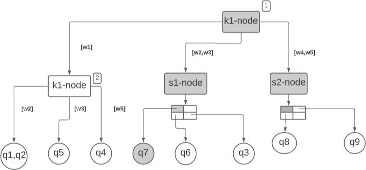

Εικόνα 2.7.1.1. AP-Tree

### ΠΑΡΑΔΕΙΓΜΑ 2

Στο συγκεκριμένο παράδειγμα θα κάνουμε ακριβώς την ιδιά λειτουργεία για το ο2. Όπως βλέπουμε το ο2 έχει μόνο ένα keyword το οποίο είναι το w1, οπότε χτυπάει το πρώτο cut C[w1] και επισκέπτεται τον κόμβο k2-node όμως δεν μπορεί να αναλυθεί παραπάνω και δεν υπάρχει κάποιο dummy cut (εικόνα 2.7.2.1.) για να προσπελάσει με αποτέλεσμα να μην επιστέφει τίποτα.

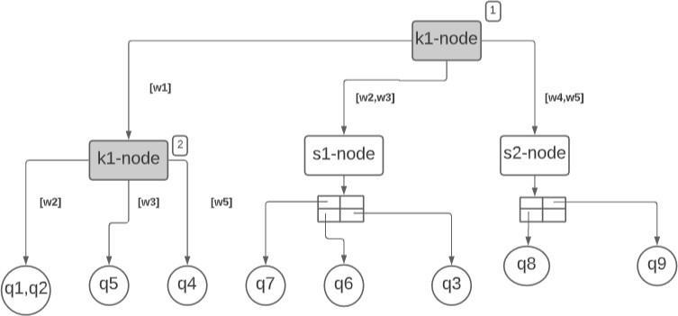

Εικόνα 2.7.2.1. AP-Tree

# FAST

## ΕΙΣΑΓΩΓΗ

Το συγκεκριμένο ευρετήριο είναι υβριδικό όπως και το προηγούμενο δηλαδή συνδυάζει μια δομή πυραμίδα για την χωρική κατάτμηση αλλά και ένα ευρετήριο για την κατάτμηση των λέξεων κλειδιών. Πιο συγκεκριμένα το fast είναι εξοπλισμένο με ένα νέο ευρετήριο κειμένου που ονομάζεται AKI. Το AKI είναι ένα ευρετήριο κειμένου δηλαδή δεν έχει ικανότητες χωρικής κατάτμησης για αυτόν τον λόγο το ενσωματώνουμε στον FAST με μια χωρική πυραμίδα. Στα επόμενα κεφάλαια θα εξηγηθεί το AKI μέσα πρώτα από έναν απλούστερο αλγόριθμο (RIL) επίσης θα αναφερθεί και η χωρική πυραμίδα αναλυτικά. Τα παραδείγματα σε αντίθεση με την υλοποίηση που έχει πραγματοποιηθεί για αυτήν την πτυχιακή όπως και στο προηγούμενο κεφάλαιο αφορούν ροές δεδομένων δηλαδή ευρετηριάζουν τα queries αντί για τα objects καθώς η δομή έχει προταθεί για αυτό το σκοπό.

## RIL

Το RIL είναι ένας αλγόριθμος ο οποίος μοιάζει με τον AKI αλλά είναι σε πολύ πιο απλή μορφή. Η περιγραφή του συγκεκριμένου αλγορίθμου θα βοηθήσει αρκετά στην κατανοήσει του AKI. Ουσιαστικά χρησιμοποιεί ένα χάρτη συχνοτήτων ο οποίος εμφανίζει την συχνότητα εμφάνισης κάθε keyword των εισαχθέντων αντικειμένων. Ανάλογα με την συχνότητα κάθε keyword που περιγράφεται από τον χάρτη συχνοτήτων επιλέγεται και το ανάλογο keyword το οποίο θα χρησιμοποιηθεί ως κλειδί για τον κόμβο οπού θα πρέπει να εισαχθεί. Τα παραπάνω θα γίνουν ποιο κατανοητά με το παράδειγμα που ακολουθεί στην επόμενη ενότητα.

### ΠΑΡΑΔΕΙΓΜΑ ΕΚΤΕΛΕΣΗΣ

Στο συγκεκριμένο παράδειγμα αναλύεται η εισαγωγή ερωτημάτων (είναι παρόμοια με των αντικειμένων) μέσα στο RIL. Όπως φαίνεται από την παρακάτω εικόνα πρώτα αναβαθμίζεται ο χάρτης συχνοτήτων και στην συνέχεια εισάγεται το q1 στο k1 άμεσος μετά αναβαθμίζεται ξανά ο χάρτης για το q2 και το προστίθεται στο k3. Η συγκεκριμένη διαδικασία επαναλαμβάνεται μέχρι να ολοκληρωθεί ο αλγόριθμος.

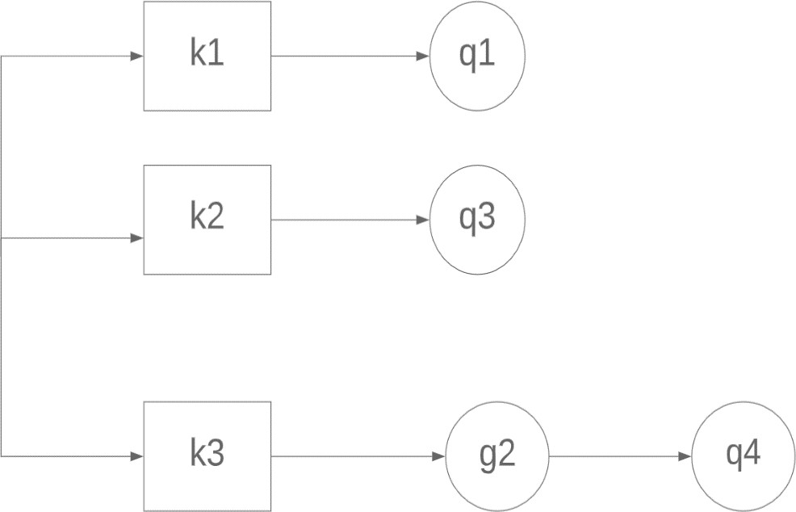

Εικόνα 3.2.1.1. Παράδειγμα εκτέλεσης RIL

## AKI

Το AKI έχει σχεδιαστεί ως χάρτης κατακερματισμού πολλαπλών επιπέδων με κόμβους κειμένου και λέξεις-κλειδιά ως το κλειδί για τον χάρτη κατακερματισμού. Ένας κόμβος κειμένου περιέχει ένα ή και τα δύο από τα ακόλουθα: πρώτων μια λίστα αντικειμένων που επισυνάπτονται σε αυτόν τον κόμβο και δευτέρων ένα χάρτη κατακερματισμού στους κόμβους κειμένου των παιδιών. Οι κόμβοι κειμένου μπορούν να προσδιοριστούν χρησιμοποιώντας μια μοναδική διαδρομή κειμένου λέξεων-κλειδιών (textual path). Οι κόμβοι κειμένου στο AKI αντιστοιχίζονται σε επίπεδα. Στο ανώτερο επίπεδο βρίσκεται ένας κόμβος κειμένου που δεν έχει γονικό κόμβο και αναγνωρίζεται χρησιμοποιώντας διαδρομή κειμένου με μία μόνο λέξη-κλειδί. Οι κόμβοι με κείμενο που δεν περιέχουν θυγατρικούς κόμβους είναι κόμβοι φύλλα. Τα επίπεδα των κόμβων κειμένου στο AKI αριθμούνται σταδιακά, όπου το ανώτερο επίπεδο είναι αριθμημένο ως Επίπεδο 1.

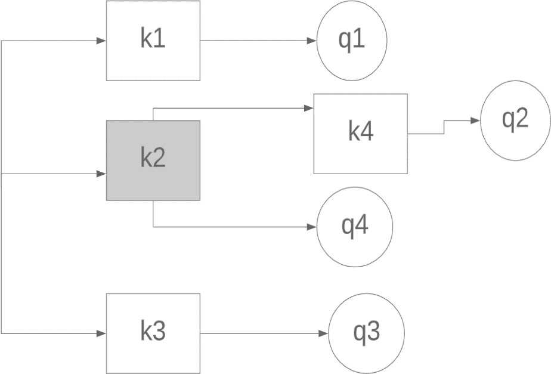

Εικόνα 3.3.1. AKI index

Για παράδειγμα όπως φαίνεται στην παραπάνω εικόνα (εικόνα 3.3.1.) ο k4 που είναι ενωμένος με τον k2 μπορεί να εκφραστεί από το μονόπατη του k2k4. Ακόμα κομβόι φύλλα λογίζονται οι k4,k3,k1 και κόμβος γονέας λογίζεται ο k2.

### ΣΠΑΝΙΟΙ ΚΑΙ ΣΥΧΝΟΙ ΚΟΜΒΟΙ

Για κάθε λέξη-κλειδί ο συνολικός αριθμός αντικειμένων, αποθηκεύεται σε έναν πίνακα κατακερματισμού που ονομάζεται χάρτης συχνοτήτων. Στο AKI, τα αντικείμενα εισάγονται πρώτα σε κόμβους κειμένου ανώτερου επιπέδου χρησιμοποιώντας τη λιγότερο συχνή λέξη- κλειδί. Η λιγότερο συχνή λέξη-κλειδί προσδιορίζεται χρησιμοποιώντας το χάρτη συχνοτήτων. Ένας κόμβος κειμένου παραμένει σπάνιος όσο ο αριθμός των αντικειμένων που πρέπει να επισυνάπτουν σε αυτόν τον κόμβο, είναι μικρότερος από ένα συγκεκριμένο όριο, που ονομάζεται κατώφλι (threshold).

### ΑΛΓΟΡΙΘΜΟΣ ΕΙΣΑΓΩΓΗΣ

Η εισαγωγή των αντικειμένων γίνεται με τον εξής τρόπο, πρώτα ο αλγόριθμος ενημερώνει τον χάρτη συχνοτήτων και στην συνέχεια από τα keywords του αντικειμένου που παίρνει σαν είσοδο για να το εισάγει επιλέγεται για κλειδί αυτό με τη μικρότερη συχνότητα. Μετα ελέγχει αν αυτό το keyword υπάρχει ήδη, αν δεν υπάρχει δημιουργεί τον κόμβο με το keyword που επέλεξε πριν για κλειδί ,αν υπάρχει τότε προχωράει σε περεταίρω ελέγχους. Αυτοί οι έλεγχοι είναι οι εξής πρώτα κοιτάει αν δεν ξεπερνιέται το κατώφλι των αντικειμένων που μπορούν να εισαχθούν, αν ισχύει αυτή η συνθήκη τότε καταχωρεί στον κόμβο το αντικείμενο αλλιώς προσπαθεί να μετακινήσει κάποιο από τα αλλά αντικείμενα σε κάποιον άλλο κόμβο. Σε περίπτωση που και πάλι δεν μπορεί να το εισάγει κάπου τότε αφαιρεί όλα τα αντικείμενα από τους κόμβους που προσπάθησε να το εισάγει και τους μετατρέπει σε συχνούς και τότε

ξεκινάει και καταχωρεί τα αντικείμενα που αφαίρεσε ταξινομώντας τα keywords με λεξικογραφική σειρά και όχι σύμφωνα με τον χάρτη συχνοτήτων. Όποιά από αυτά πάνε να εισαχθούν σε κόμβο που ξεπερνάει το κατώφλι εισάγονται σε κόμβο παιδί στον ανάλογο κόμβο με κλειδί το textual path. Αυτή η διαδικασία θα γίνει πιο κατανοητή στα παραδείγματα εκτέλεσης στα επόμενα κεφάλαια.

### ΑΛΓΟΡΙΘΜΟΣ ΑΝΑΖΗΤΗΣΗΣ

Η αναζήτηση σε αντίθεση με την εισαγωγή στο συγκεκριμένο ευρετήριο είναι πολύ απλή. Συγκεκριμένα απλά αναζητά για κάθε Keyword του ερωτήματος που παίρνει σαν είσοδο το αντίστοιχο κλειδί στον κόμβο. Αν ο αυτός ο κόμβος είναι σπάνιος τότε δεν ελέγχει κόμβους παιδιά καθώς δεν είναι δυνατόν να έχει, αν όμως είναι συχνός τότε ελέγχει αν υπάρχουν και κόμβοι παιδιά. Αναλυτικότερα μετακινείτε μέσα στο AKI ανάλογα με τα Keywords που έχει το ερώτημα και στο τέλος επιστρέφει τα αντικείμενα που πληρούν τα κριτήρια δηλαδή αυτά που τα Keywords τους είναι υποσύνολο των keywords του ερωτήματος που δίνεται σαν είσοδο.

### ΠΑΡΑΔΕΙΓΜΑ ΕΚΤΕΛΕΣΗΣ 1

Στην συγκεκριμένη ενότητα αναλύεται ένα απλό παράδειγμα εκτέλεσης στον AKI αλγόριθμο. Όπως φαίνεται από την εικόνα 3.3.2.1. εισάγονται 3 ερωτήματα (παρόμοιος τρόπος και για αντικείμενα) το q1,q1,q3 με κατώφλι 2. Για να τα εισάγει αυτά ο αλγόριθμος πρώτα δημιουργεί τον χάρτη με τις συχνότητες και για κάθε ερώτημα επιλέγει από τα keyword που περιέχουν αυτό με τον ελάχιστο αριθμό εμφανίσεων και το καταχωρεί σαν κλειδί στον κόμβο που θα δημιουργήσει δηλαδή από το q1 επιλέγεται το k1 από το q2 το k2 και από το q3 to k3.

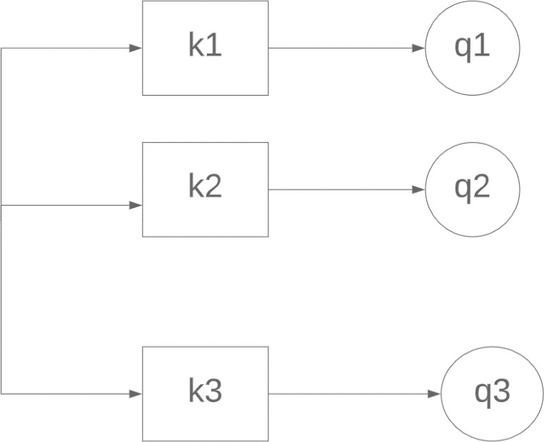

Εικόνα 3.3.4.1. παράδειγμα εκτέλεσης AKI 1

### ΠΑΡΑΔΕΙΓΜΑ ΕΚΤΕΛΕΣΗΣ 2

Στην συγκεκριμένη ενότητα αναλύεται ένα πιο περίπλοκο παράδειγμα εισαγωγής ερωτημάτων για αυτό παρουσιάζεται σε 3 βήματα (διευκρινίζεται ότι το κατώφλι είναι ίσο με 2).

| Query | Keywords |
|-------|----------|
| q1    | K1k2     |
| q2    | K1k2     |
| q3    | K1k2     |
| q4    | K3k6     |
| q5    | K1k3     |
| q6    | K1k2k3   |
| q7    | K2k3kk7  |
| q8    | K2       |
| q9    | K3       |

Εικόνα 3.3.5.1. Πίνακας εισερχομένων queries

#### ΒΗΜΑ 1

Όπως φαίνεται και στην παραπάνω εικόνα (εικόνα 3.3.5.1) πρώτα εισάγεται το q1 το οποίο αποτελείτε από τα keywords k1,k2. Οπότε ως πρώτο βήμα κατασκευάζεται ο χάρτης συχνοτήτων και δημιουργείται ο κόμβος k1 μέσα στον οποίο εισάγεται το q1(εικόνα 3.3.5.1.1.).

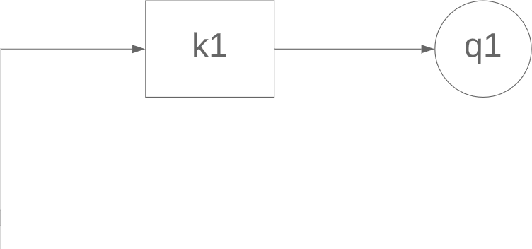

Εικόνα 3.3.5.1.1. Εισαγωγή q1

#### ΒΗΜΑ 2

Στο συγκεκριμένο βήμα εισάγεται το q2 που αποτελείτε από τα keywords k1,k2. Ενημερώνοντας τον πίνακα περιεχομένων γίνεται αντιληπτό πως και τα δυο keywords έχουν την ιδιά συχνότητα εμφάνισης αρά επιλέγεται το πρώτο δηλαδή το k1. Στην συνέχεια ελέγχεται αν ο k1 υπάρχει και εφόσον υπάρχει αν ξεπερνάει το threshold. Ο k1 γνωρίζοντας και από το προηγούμενο βήμα υπάρχει και το κατώφλι είναι μικρότερό του 2 οπότε εισάγεται το q2 στον k1(εικόνα 3.3.5.2.1.).

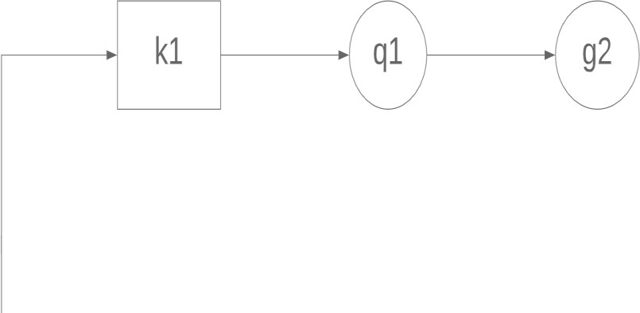

Εικόνα 3.3.5.2.1. Εισαγωγή q2

#### ΒΗΜΑ 3

Η ιδιά διαδικασία ακολουθείται μέχρι και το q8 (εικόνα 3.5.3.3.1.). Το ενδιαφέρων σημείο είναι όταν πάει να εισαχθεί το q9 και αυτό θα αναλυθεί σε αυτό το βήμα. Όπως παρατηρείται το q9 έχει μόνο ένα keyword το k3, αλλά ο κόμβος με κλειδί το k3 έχει δυο queries που έχουν εισαχθεί σε αυτόν οπότε το q9 για να εισαχθεί εκεί πρέπει να γίνουν οι εξής ενέργειες: Πρώτων ο αλγόριθμος θα προσπαθήσει να μεταφέρει κάποιο από τα queries που έχουν εισαχθεί στον k3 πράγμα το οποίο δεν έχει κανένα αποτέλεσμα καθώς στους κόμβους k1 και k2 οπού μπορούν τα ερωτήματα να μεταφερθούν έχουν αριθμό ερωτημάτων ίσο με το κατώφλι. Η ακριβώς επόμενη ενέργεια είναι η σήμανση των κόμβων k1 και k2 ως συνέχεις. Στην εικόνα 3.5.3.3.1. τα ερωτήματα που συνδέονται με κόμβους k1, k2 και k3 θα συνδεθούν

ξανά σε αυτούς τους κόμβους κειμένου χρησιμοποιώντας την πρώτη λέξη-κλειδί στο κείμενο τους σύμφωνα με την λεξικογραφική σειρά των λέξεων-κλειδιών. Στην εικόνα 3.5.3.3.2. το q9 εισάγεται στον k3. Επίσης, τα q1, q2, q3, q5 και q6 πρέπει να εισαχθούν στον k1. Ωστόσο, ο αριθμός των ερωτημάτων που επισυνάπτονται στον συνεχή κόμβο k1 υπερβαίνει το κατώφλι. Έτσι δημιουργούνται οι κόμβοι k1k2 και k1k3 στο Επίπεδο 2 και κόμβος k1k2k3 στο Επίπεδο 3 για να γίνει διάκριση μεταξύ q1, q2, q3, q5 και q6. Ο k1k3 επισημαίνεται ως σπάνιος γιατί μόνο το q5 είναι συνδεδεμένο σε αυτόν. Ο k1k2 επισημαίνεται ως συχνός επειδή τα ερωτήματα q1, q2 και q3 συνδέονται με αυτόν.

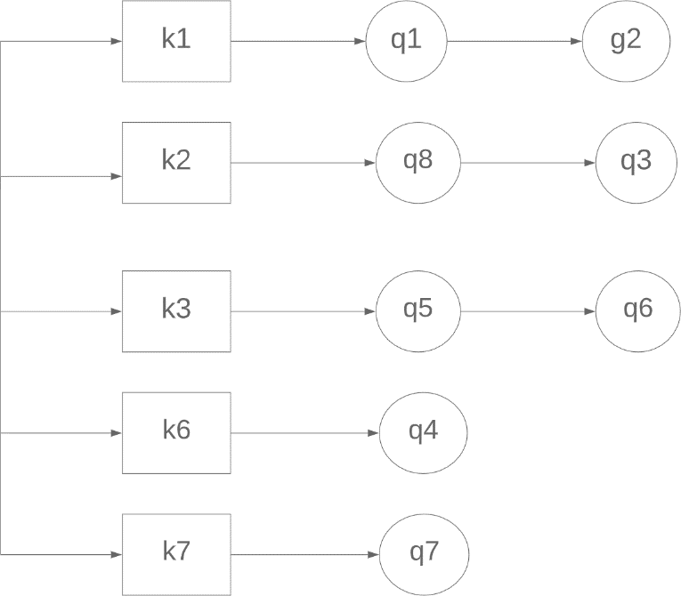

Εικόνα 3.5.3.3.1. AKI πριν την εισαγωγή του q9

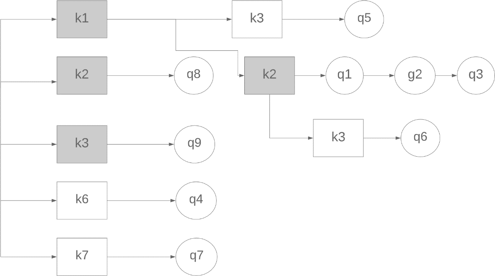

Εικόνα 3.5.3.3.2. AKI μετά την εισαγωγή του q9

## ΧΩΡΙΚΗ ΠΥΡΑΜΙΔΑ

Η προσαρμοστική ευρετηρίαση κειμένου χρησιμοποιώντας το AKI δεν επαρκεί για την ευρετηρίαση αντικειμένων που μοιράζονται το ίδιο σύνολο λέξεων-κλειδιών και έχουν διαφορετικές χωρικές τοποθεσίες. Για τον σκοπό αυτό ενσωματώνεται η χωρική πυραμίδα στο AKI. Η χωρική πυραμίδα είναι ένα πολλαπλών επιπέδων και πολλαπλών αναλύσεων ευρετήριο. Κάθε επίπεδο στη χωρική πυραμίδα περιέχει ένα χωρικό πλέγμα με συγκεκριμένη ανάλυση. Τα επίπεδα στην χωρική πυραμίδα είναι αριθμημένα από κάτω προς τα πάνω με το επίπεδο 0 να είναι το χαμηλότερο επίπεδο(εικόνα 3.4.1.).

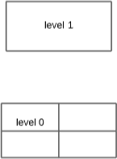

Εικόνα 3.4.1. Παράδειγμα επίπεδων σε μια χωρική πυραμίδα.

### ΠΛΕΓΜΑ

Το πλέγμα σύμφωνα με το οποίο έχει πραγματοποιηθεί ο αλγόριθμος στα πλαίσια αυτής της εργασίας ακολουθεί μια διαφορετική φόρμουλα εισαγωγής από αυτήν που περιγράφει το paper. Συγκεκριμένα για την εισαγωγή στο πλέγμα χρησιμοποιείται ο συγκεκριμένος τύπος που φαίνεται παρακάτω (εικόνα 3.4.1.1.). Η ιδιά φόρμουλα όπως είναι φυσικό χρησιμοποιείται και για την ανάκτηση από το πλέγμα.

𝑑𝑥 =

𝑥𝑚𝑎𝑥 𝜆έ𝛾𝜇𝛼𝑟𝑜𝜍 − 𝑥𝑚𝑖𝑛 𝜆έ𝛾𝜇𝛼𝑟𝑜𝜍 \#𝛾𝛼𝜇𝜇𝜀𝜍

𝑑𝑦 =

𝑦𝑚𝑎𝑥 𝜆έ𝛾𝜇𝛼𝑟𝑜𝜍 − 𝑦𝑚𝑖𝑛 𝜆έ𝛾𝜇𝛼𝑟𝑜𝜍 \#𝜎𝑟𝜂𝜆𝜀𝜍

𝛾𝛼𝜇𝜇ή 𝜀𝑙𝜎𝛼𝛾𝜔𝛾ή𝜍 = ⌊(𝑥𝑚𝑎𝑥 𝜀𝜔𝑟ή𝜇𝛼𝑟𝑜𝜍 − 𝑥𝑚𝑖𝑛 𝜀𝜔𝑟ή𝜇𝛼𝑟𝑜𝜍) −

𝑥𝑚𝑖𝑛 𝜆έ𝛾𝜇𝛼𝑟𝑜𝜍

𝑑𝑥 ⌋

𝜎𝑟ή𝜆𝜂 𝜀𝑙𝜎𝛼𝛾𝜔𝛾ή𝜍 = ⌊(𝑥𝑚𝑎𝑥 𝜀𝜔𝑟ή𝜇𝛼𝑟𝑜𝜍 − 𝑥𝑚𝑖𝑛 𝜀𝜔𝑟ή𝜇𝛼𝑟𝑜𝜍) −

Εικόνα 3.4.1.1. Φόρμουλα εισαγωγής στο πλέγμα.

𝑥𝑚𝑖𝑛 𝜆έ𝛾𝜇𝛼𝑟𝑜𝜍

𝑑𝑦 ⌋

## ΚΑΤΑΣΚΕΥΗ FAST

### ΑΛΓΟΡΙΘΜΟΣ ΕΙΣΑΓΩΓΗΣ

Το fast είναι ένα υβριδικό ευρετήριο το οποίο συνδυάζει μια χωρική πυραμίδα με ένα ευρετήριο κειμένου το AKI. Πιο αναλυτικά για την κατασκευή του fast δημιουργείται πρώτα μια πυραμίδα οπού ο αριθμός των επίπεδων αποφασίζεται από τον χρήστη. Το κάθε επίπεδο έχει διαφορετικό αριθμό κελίων ή διαφορετική ανάλυση οπού ο αριθμός τον κελίων ξεκινάει από το 1 στο κορυφαίο επίπεδο και τετραπλασιάζεται στα κατωτέρα επίπεδα. Το κάθε κελί περιέχει ένα ευρετήριο AKI (εικόνα 3.5.1.1.) το οποίο αναλαμβάνει την κειμενική ευρετηριάσει του κάθε αντικειμένου που πρέπει να εισαχθεί. Η εισαγωγή ενός αντικειμένου από ένα επίπεδο σε ένα άλλο γίνεται όταν ένας κόμβος έχει 4 φορές περισσότερα αντικείμενα συνδεδεμένα σε αυτόν από ότι του επιτρέπει το κατώφλι που έχει οριστεί.

Πιο αναλυτικά, ενημερώνονται οι συχνότητες λέξεων-κλειδιών στο χάρτη συχνοτήτων σύμφωνα με το αντικείμενο που εισάγεται. Στη συνέχεια, στο ανώτερο επίπεδο της χωρικής πυραμίδας, επισυνάπτεται το εισερχόμενο αντικείμενο σε ένα σπάνιο κόμβο κειμένου χρησιμοποιώντας τη λιγότερο συχνή λέξη-κλειδί του αντικειμένου. Εάν το αντικείμενο έχει περισσότερες από μια σπάνιες λέξεις-κλειδιά, επιλέγεται αυθαίρετα μια από το σύνολο των λέξεων-κλειδιών. Εάν το εισερχόμενο αντικείμενο δεν μπορεί να συνδεθεί με έναν σπάνιο κόμβο κειμένου AKI, προωθείτε στους συχνούς κόμβους AKI σύμφωνα με την λεξικογραφική σειρά των λέξεων-κλειδιών του αντικειμένου. Συνδέοντας λοιπών το εισερχόμενο αντικείμενο σε έναν συχνό κόμβο κειμένου AKI, ελέγχεται εάν απαιτείται να αφαιρεθούν αντικείμενα που συνδέονται με αυτόν, σε περίπτωση δηλαδή που αυτό υπερβαίνει το 4

\*κατώφλι. Εάν απαιτείται αυτή η λειτουργία, προσδιορίζονται τα αντικείμενα που πρέπει να κατέβουν στο επόμενο επίπεδο της χωρικής πυραμίδας.

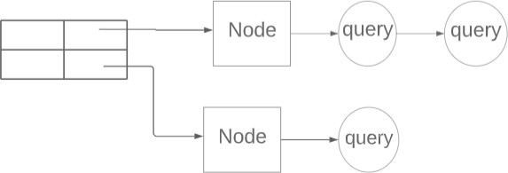

Εικόνα 3.5.1.1. Οπτικοποίηση του FAST με ερωτήματα αντί αντικειμένων.

### ΑΛΓΟΡΙΘΜΟΣ ΑΝΑΖΗΤΗΣΗΣ

Ο αλγόριθμος αναζήτησης λειτουργεί ως εξής: όταν ένα εισερχόμενο ερώτημα φτάνει, πρέπει να επιθεωρηθεί έναντι της σχετικής πυραμίδας και του AKI. Η διαδικασία αναζήτησης ξεκινά από το υψηλότερο επίπεδο πυραμίδας. Για ένα ερώτημα το πολύ ένας κόμβος πυραμίδας ανά επίπεδο μπορεί να αντιστοιχιστεί μαζί του. Εντοπίζεται το ευρετήριο κάθε σχετικού κόμβου πυραμίδας χρησιμοποιώντας την σχέση που περιγράφεται στο προηγούμενο κεφάλαιο (κεφ. 3.4.1.). Οι λέξεις-κλειδιά του ερωτήματος ταξινομούνται λεξικογραφικός. Στην συνέχεια ανακτώνται όλοι οι κόμβοι κειμένου για κάθε λέξη-κλειδί. Εάν στο υψηλότερο επίπεδο κειμένου ο κόμβος είναι σπάνιος, ελέγχονται τα αντικείμενα που περιέχει ο συγκεκριμένος κόμβος σύμφωνα με τα χωρικά αλλά και τα κείμενά κριτήρια. Εάν ο κόμβος είναι συχνός, τα παιδιά αυτού του κόμβου αναζητούνται αναδρομικά όπως περιγράφεται. Στη διαδικασία αντιστοίχισης, η χωρική επικύρωση των ερωτημάτων επαληθεύει ότι το αντικείμενο δεδομένων βρίσκεται εντός του χωρικού εύρος του ερωτήματος. Η επικύρωση κειμένου επαληθεύει ότι αυτό το αντικείμενο δεδομένα περιέχει όλες τις λέξεις-κλειδιά του ερωτήματος.

Algorithm 1 Search (Data object o) 1 keywords ← o.text

1.  for level = levelmax; level \>= levelmin; level − − do
1.  nextLevelKeywords ← {}
1.  Np ← getSpatialP yramidNode(level, o.loc)
1.  if Np is not Null then
1.  for i = 1;i \<= \|keywords\|;i + + do
1.  Nt ← Np.get(keywords[i])
1.  if Nt is infrequent then
1.  foreach Query q in Nt.qlist do
1.  if q not expired and o.loc inside q.MBR and keywords contains q.text then
1.  add q to result
1.  else
1.  nextLevelKeywords.add(keywords[i])
1.  SearchFrequent( i,Nt, o, keywords,level)
1.  keywords ← nextLevelKeywords

Αλγόριθμος 1. Αλγόριθμος αναζήτησης για το FAST

Algorithm 2 SearchchildNodes( i,Nt, o, keywords,level) 1 if Nt is infrequent then

1.  foreach Query q in Nt.qlist do
1.  if o.loc inside q.MBR and keywords contains q.text then
1.  add q to result 5 else
2.  foreach Query q in Nt.qList do
1.  if o.loc inside q.MBR then
1.  add q to result
1.  for j = (i + 1); j ≤ \|keywords\|; j + + do
1.  SearchchildNodes (j,kIndex.children.get(keywords[j]),o,keywords,level)

Αλγόριθμος 2. Αλγόριθμος αναζήτησης στα παιδιά του FAST

### ΜΗ ΥΛΟΠΟΙΗΜΕΝΟΙ ΑΛΓΟΡΙΘΜΟΙ

Όπως αναφέρεται και πιο πάνω ο αλγόριθμος που δεν έχει υλοποιηθεί εξ’ ολοκλήρου είναι αυτός της εισαγωγής στο πλέγμα καθώς έχει χρησιμοποιηθεί άλλη φόρμουλα εισαγωγής από την προβλεπόμενη. Ακόμα δεν έχει υλοποιηθεί ο αλγόριθμος καθαρισμού ο οποίος συνεισφέρει στην αποφόρτιση του ευρετηρίου σε βάθος χρόνου από τα ληγμένα ερωτήματα.

# ΠΕΙΡΑΜΑΤΙΚΗ ΜΕΛΕΤΗ

## ΡΥΘΜΙΣΕΙΣ ΠΕΙΡΑΜΑΤΟΣ

Σε αυτήν την ενότητα, αναφέρονται τα αποτελέσματα της πειραματικής μελέτης. Όλοι οι αλγόριθμοι εφαρμόζονται σε Java.

### ΔΕΔΟΜΕΝΑ

Τα datasets που χρησιμοποιούνται για την παραπάνω πειραματική είναι τρία και έχουν παραχθεί από μια random συνάρτηση οπού το κάθε ένα έχει διαφορετικό μέγεθος αλλά το ίδιο vocabulary το οποίο είναι μικρό επειδή τα datasets που χρησιμοποιούνται δεν είναι πολύ μεγάλα. Τα object τα οποία δημιούργει αυτή η random μέθοδος αποτελούνται από 1 έως 10 γράμματα τα οποία επιλέγονται τυχαία από ένα σύνολο δεδομένων που περιλαμβάνει τα 12 πρώτα γράμματα της αλφαβήτας αλλά και από την γεωγραφική τοποθεσία του συγκεκριμένου object. Η τοποθεσία του object παράγεται τυχαία (αναλυτικά τα datasets φαίνονται στον πίνακα 1).

Συγκεκριμένα δημιουργούνται τα παραπάνω datasets με σκοπό να δοκιμαστεί ο αλγόριθμος σε ακραίες τιμές. Αυτές οι ακραίες τιμές δημιουργούνται με την χρησιμοποιήσει μικρού vocabulary το οποίο αναγκάζει τους αλγορίθμους να χωρίσουν τα δεδομένα με βάση το κείμενο σε πολύ μικρά σύνολα.

ΠΙΝΑΚΑΣ 1

| Datasets        | Random1 | Random 2 | Random 3 |
|-----------------|---------|----------|----------|
| \#objects       | 100K    | 500K     | 1M       |
| Vocabulary size | 12      | 12       | 12       |

### ΑΛΓΟΡΙΘΜΟΙ

Στην συγκεκριμένη μελέτη συγκρίνονται οι παρακάτω αλγόριθμοι ως προς τον χρόνο δημιουργίας αλλά και αναζήτησης μέσα σε αυτούς

-   FAST: είναι ένα αλγόριθμος οπού ταξινομεί τα αντικείμενα με βάση το AKI index αλλά και μια δομή πυραμίδα. Ο συγκεκριμένος αλγόριθμος χρησιμοποιεί για την ευρετηρίαση των δεδομένων την συχνότητα εμφάνισης του κάθε ενός αλλά και την τοποθεσία στην οποία βρίσκεται. Όλα τα παραπάνω αναλύονται λεπτομερέστερα σε προηγούμενα κεφάλαια,
-   AP-TREE: είναι ένα αλγόριθμος οπού ταξινομεί τα αντικείμενα μέσα σε μια δομή δέντρο η οποία περιλαμβάνει τρία ειδή κόμβων (spatial node,textual node,query node) αλλά και συμφώνα με δυο συναρτήσεις κόστους οι οποίες καθορίζουν τον τύπο κόμβου που πρέπει να δημιουργηθεί. Όλα τα παραπάνω αναλύονται λεπτομερέστερα σε προηγούμενα κεφάλαια,
-   RIL: είναι ένας αλγόριθμος για την ευρετηρίαση αντικειμένων κειμένου (χωρίς χωρική πληροφορία). Στο RIL, τα αντικείμενα κειμένου ευρετηριάζονται με βάση τη λιγότερο συχνή

λέξη-κλειδί τους. Κάθε λέξη-κλειδί έχει μια λίστα ανάρτησης αντικειμένων κειμένου που επισυνάπτεται σε αυτήν τη λέξη-κλειδί,

-   ΑΚΙ: είναι ένας αλγόριθμος που έχει σχεδιαστεί ως χάρτης κατακερματισμού πολλαπλών επιπέδων κόμβων κειμένου με λέξεις-κλειδιά ως το κλειδί του χάρτη κατακερματισμού. Ένας κόμβος κειμένου, περιέχει ένα ή και τα δύο από τα ακόλουθα:(1) μια λίστα αντικειμένων που επισυνάπτονται σε αυτόν τον κόμβο και (2) ένα χάρτη κατακερματισμού για τους κόμβους κειμένου των παιδιών με λέξεις-κλειδιά ως το κλειδί του χάρτη κατακερματισμού.

### ΠΑΡΑΜΕΤΡΟΙ

Για την συγκεκριμένη μελέτη το μέγεθος του κατωφλιού είναι σταθερό και ίσο με 3 για τους κόμβους που τελικός περιέχουν τα αντικείμενα. Αυτό σημαίνει ότι κάθε τέτοιος κόμβος μπορεί να περιέχει έως και τρία αντικείμενα. Το νούμερο αυτό μπορεί αν μεταβληθεί να έχει ως φυσικό επακολουθώ την πιο γρήγορη ευρετηριάσει των δεδομένων αλλά την πιο αργή ανάκτηση τους καθώς περισσότερα αντικείμενα θα συνδέονται σε έναν κόμβο.

### ΜΕΤΡΗΣΕΙΣ

Οι αλγόριθμοι αξιολογούνται σύμφωνα με τους χρόνους που κάνουν για να ευρετηριάσουν τα δεδομένα αλλά και να γίνει αναζήτηση πάνω σε αυτούς.

## ΑΞΙΟΛΟΓΗΣΗ ΑΠΟΔΟΣΗΣ

### ΑΞΙΟΛΟΓΗΣΗ ΣΕ ΔΙΑΦΟΡΕΤΙΚΑ ΣΥΝΟΛΑ ΔΕΔΟΜΕΝΩΝ

Στα παρακάτω πειράματα αξιολογείται ο μέσος χρόνος αντιστοίχισης αντικειμένων και χρόνος κατασκευής ευρετηρίου έναντι τριών συνόλων δεδομένων Random 1, Random 2 και Random 3 (πίνακας 1).

#### AKI & RIL

Όπως φαίνεται στην εικόνα 4.2.1.1.1, το AKI ως προς τον χρόνο αναζήτησης είναι πολύ πιο γρήγορο πράγμα που είναι λογικό καθώς το AKI προσπαθεί να περιορίσει το μήκος των λιστών των αντικειμένων που συνδέονται με κόμβους κειμένου ώστε να αποτρέψει τις μεγάλες λίστες αντικειμένων. Ακριβώς για τον από πάνω λόγο, δηλαδή ότι το AKI προσπαθεί να περιορίσει το μήκος των λιστών των αντικειμένων, το AKI σε αντίθεση με το RIL είναι πολύ πιο αργό στην κατασκευή του όπως φαίνεται και στη εικόνα 4.2.1.1.2.

Εικόνα 4.2.1.1.1. Σύγκριση μεταξύ RIL και AKI σύμφωνα με τον χρόνο αναζήτησης.

Εικόνα 4.2.1.1.2. Σύγκριση μεταξύ RIL και AKI σύμφωνα με τον χρόνο ευρετηριάσεις.

#### FAST & AP-TREE

Όπως φαίνεται στην εικόνα 4.2.2.1.2., το AP-Tree ως προς τον χρόνο αναζήτησης είναι πιο γρήγορο από τον fast πράγμα που είναι λογικό καθώς το AP-Tree είναι ένας προσαρμοστικός αλγόριθμος ο οποίος διαχωρίζει τα αντικείμενα σε s-node ή k-node ανάλογα με κάποιες συναρτήσεις κόστους (κεφ. 2.6.1.) πράγμα που δεν κάνει ο fast. Όσο αφορά τον χρόνο κατασκευής πάλι είναι πιο γρήγορο το AP-Tree από το fast όπως φαίνεται στην εικόνα 4.2.2.1.2..

Εικόνα 4.2.1.2.1. Σύγκριση μεταξύ ap-tree και fast σύμφωνα με τον χρόνο ευρετηριάσεις.

Εικόνα. 4.2.1.2.2. Σύγκριση μεταξύ ap-tree και fast σύμφωνα με τον χρόνο αναζήτησης

# ΣΥΜΠΕΡΑΣΜΑ

Σε αυτήν την εργασία, συγκρίνονται δυο διαδεδομένοι αλγόριθμοι οι οποίοι ειδικεύονται στην αποτελεσματική οργάνωση ενός τεράστιου αριθμού αντικειμένων έτσι ώστε κάθε αντικείμενο να μπορεί να παραδοθεί γρήγορα στα σχετικά ερωτήματα. Οι δυο αυτοί αλγόριθμοι χρησιμοποιούν διαφορετικούς τρόπους για να επιτύχουν το παραπάνω. Το AP- Tree είναι ένας προσαρμοστικός αλγόριθμος που επιλέγει προσεκτικά αν θα χρησιμοποιήσει κατάτμηση με βάση μια λέξη-κλειδί ή χωρική κατάτμηση καθοδηγούμενος από ένα μοντέλο κόστους. Το fast χρησιμοποιεί ένα καινούργιο ευρετήριο κειμένου το AKI σε συνδυασμό με μια χωρική πυραμίδα. Μέσα από την πειραματική μελέτη αποδειχτικέ ότι το AKI είναι ένα πιο αποτελεσματικό ευρετήριο σε σχέση με το RIL καθώς μπορεί στον χρόνο κατασκευής να είναι πιο αργό αλλά στον χρόνο αναζήτησης που είναι ο βασικός παράγοντας είναι πολύ πιο γρήγορο. Ακόμα αποδειχτικέ ότι το AP-Tree σε όλους τους τομείς (κατασκευής και αναζήτησης ) είναι πιο αποτελεσματικό από το fast.

# ΒΙΛΙΟΓΡΑΦΙΑ

1.  X. Wang, Y. Zhang, W. Zhang, X. Lin, and W. Wang, “Ap-tree: Efficiently support continuous spatial-keyword queries over stream,” in ICDE, 2015, pp. 1107–1118.
2.  L. Chen, G. Cong, C. S. Jensen, and D. Wu, “Spatial keyword query processing: An experimental evaluation,” in VLDB, vol. 6, no. 3, 2013, pp. 217–228.
3.  Ahmed R. Mahmood, Ahmed M. Aly, Walid G. Aref: FAST: Frequency-Aware Indexing for Spatio-Textual Data Streams. ICDE 2018: 305-316.
